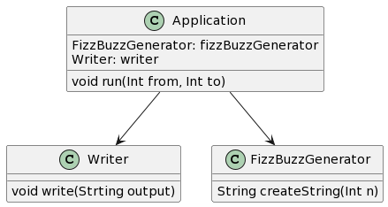

Write a program that prints the numbers from 1 to 5. For the number ‘3’ it prints “Fizz” instead of the number and for ‘5’ it prints “Buzz”. 

## Output
1, 2, Fizz, 4, Buzz

## Plant UML

class Application {
  FizzBuzzGenerator: fizzBuzzGenerator
  Writer: writer
  void run(Int from, Int to)
}

class Writer {
  void write(Strting output)
}

class FizzBuzzGenerator {
  String createString(Int n)
}

Application-->Writer
Application-->FizzBuzzGenerator
